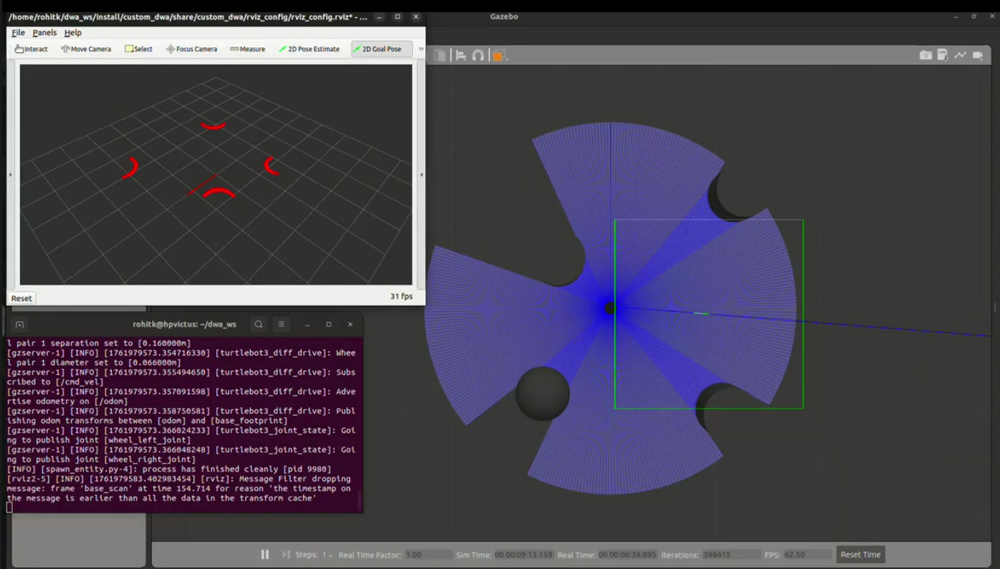

# 🐢 Custom DWA ROS2
### *Custom Dynamic Window Approach (DWA) Local Planner for TurtleBot3 (ROS 2 Humble)*

---

## 📘 Overview
This project implements a **Custom Dynamic Window Approach (DWA) Local Planner** for the **TurtleBot3** robot in **ROS 2 Humble** using the **Gazebo** simulator.  
The DWA algorithm enables the robot to **navigate smoothly to a goal position while avoiding obstacles**, considering its dynamic constraints such as velocity and acceleration limits.

You can visualize and control the robot using **RViz2** and send navigation goals interactively through the **Nav2** stack.

---
## 🧭 DWA Trajectory Visualization (Click to Play Demo)

[](https://drive.google.com/file/d/1bZOr0EKZZezLPvlJQPz5Ep2Z438SkvrJ/view?usp=sharing)

---

## 🧩 Features
- ✅ Fully compatible with **ROS 2 Humble**
- 🤖 Implements a **custom DWA local planner** in Python  
- 🚗 Works seamlessly with **TurtleBot3 Burger model**
- 🌍 Integrated with **Gazebo** for simulation
- 🧭 Supports **goal setting through RViz2**
- 🧠 Demonstrates **obstacle avoidance** and **smooth motion planning**

---

## 🛠️ Requirements

Before you begin, make sure you have the following installed:

- **Ubuntu 22.04 LTS**
- **ROS 2 Humble Hawksbill**
- **Gazebo 11 or later**
- **TurtleBot3 packages**


```
📂 Project Structure
```bash
dwa_ws/
├── build/
├── install/
├── log/
├── src/
│   ├── custom_dwa/
│   │   ├── custom_dwa/
│   │   │   ├── __init__.py
│   │   │   ├── dwa_planner_node.py          # Custom DWA planner logic
│   │   ├── launch/
│   │   │   └── dwa_planner_launch.py        # Launch file for the planner
│   │   ├── resource/
│   │   │   └── custom_dwa
│   │   ├── rviz_config/
│   │   │   └── rviz_config.rviz             # RViz visualization config
│   │   ├── package.xml
│   │   ├── setup.cfg
│   │   └── setup.py
│   │
│   ├── my_worlds/
│   │   ├── launch/
│   │   │   └── my_custom_launch.py          # Launches Gazebo + RViz + robot
│   │   └── worlds/
│   │       └── my_world.world               # Custom Gazebo world
│   │
│   ├── CMakeLists.txt
│   └── package.xml

```

⚙️ Installation & Setup
1️⃣ Clone the repository

Clone this project inside your ROS 2 workspace (for example ~/dwa_ws/src):
```bash
mkdir -p ~/dwa_ws/src
cd ~/dwa_ws/src
git clone https://github.com/rohitkunnath/custom_dwa_ros2.git
mv custom_dwa_ros2/src/* .
rm -rf custom_dwa_ros2
```
2️⃣ Build the workspace
```bash
cd ~/dwa_ws
colcon build
```
3️⃣ Source the setup files

After building, source the environment:
```bash
source /opt/ros/humble/setup.bash
source ~/dwa_ws/install/setup.bash
```
If you already have TurtleBot3 installed, also source:
```bash
source ~/turtlebot3_ws/install/setup.bash
```
🧠 Environment Configuration

Before launching, set your TurtleBot3 model (for example, burger):
```bash
export TURTLEBOT3_MODEL=burger
```
(Optional) To make this permanent, add the line above to your ~/.bashrc.

🚀 Running the Simulation
1️⃣ Launch Gazebo and RViz
```bash
ros2 launch my_worlds my_custom_launch.py
```
This will:

    Launch the Gazebo simulation with your custom world

    Spawn the TurtleBot3 Burger

    Launch RViz2 for visualization

2️⃣ Send a Navigation Goal

In RViz2, use the “2D Goal Pose” tool to click on a destination point.
Your TurtleBot3 will start navigating toward the goal using the Custom DWA Planner.

🧪 Verification

    Observe the robot in Gazebo avoiding obstacles and moving toward the goal.

    Monitor real-time motion and path planning in RViz2.
